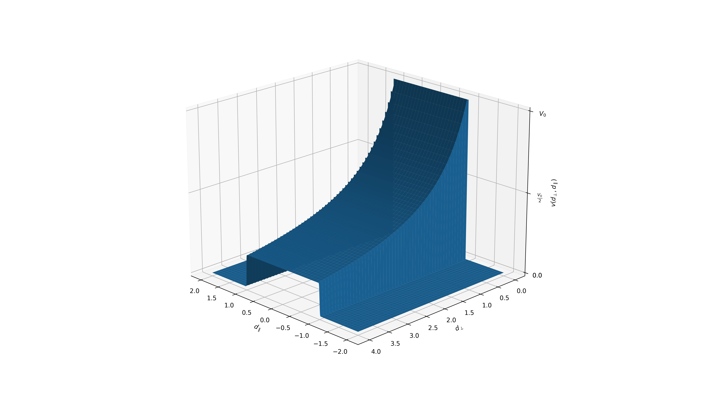
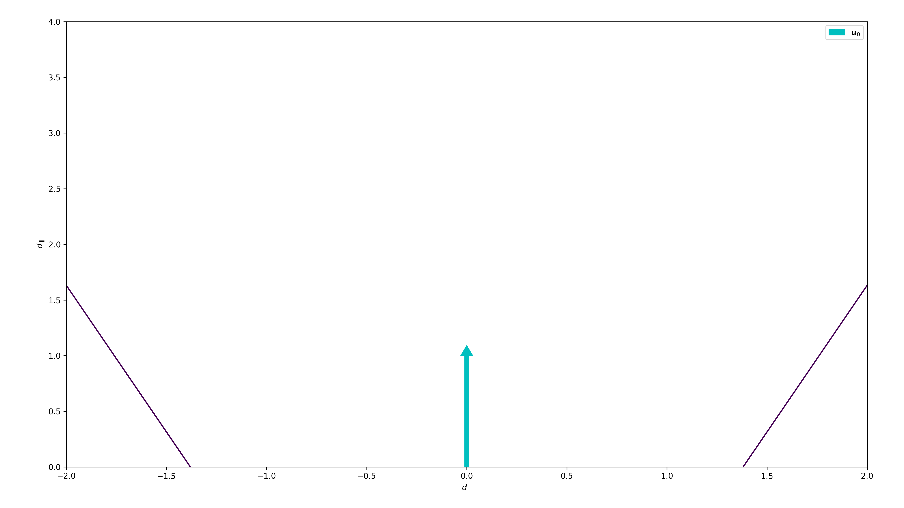

# Function Generator

$\verb|json|$ formatting to generate wind-generating functions. The function description field is called $\verb|"generator"|$, and is one of the fan's fields. In the examples reported here, only the $\verb|"generator"|$ field of the fan is reported.

To each function $v_0(t)$ is also added a Gaussian noise $\mathcal{N}(0,\sigma_n^2)$, where $\sigma_n^2$ is specified by the `nosie_var` parameter in the $\verb|json|$ file, and represents the variability in the generated wind.

## $\sin$ and $\cos$ Functions
`"function"` parameter name: `"sin"`, `"cos"`

$$
v_0(t)=\frac{V_0}{2}\sin(2\pi ft+\phi_0)+\frac{V_0}{2}
$$

$$
v_0(t)=\frac{V_0}{2}\cos(2\pi ft+\phi_0)+\frac{V_0}{2}
$$

Function `"parameters"`:
- $f$: `"frequency"` parameter
- $\phi_0$: `"phase"` parameter
- $V_0$: `"v0"` parameter

<u>Example:</u>
```{json}
"generator": {
    "function": "sin",
    "parameters": {
        "v0": 15,
        "frequency": 0.01,
        "phase": 0.0
    }
}
```
```{json}
"generator": {
    "function": "cos",
    "parameters": {
        "v0": 10,
        "frequency": 0.5,
        "phase": 30.0
    }
}
```

## Square Function
`"function"` parameter name: `"square"`

$$
    v_0(t)=\frac{V_0}{2}\,\text{sign}\left(\sin\left( 2\pi ft\right)\right)+\frac{V_0}{2}
$$

Function `"parameters"`:
- $f$: `"frequency"` parameter
- $V_0$: `"v0"` parameter

<u>Example:</u>
```{json}
"generator": {
    "function": "square",
    "parameters": {
        "v0": 12,
        "frequency": 0.1,
    }
}
```

## Constant Function
$\verb|"function"|$ parameter name: $\verb|"constant"|$

$$
    v_0(t)=V_0
$$

Function `"parameters"`:
- $V_0$: `"v0"` parameter

<u>Example:</u>
```{json}
"generator": {
    "function": "constant",
    "parameters": {
        "v0": 10,
    }
}
```

# Fan Generation Function

$$
v(t,d_\perp,d_\parallel) = \frac{v_0(t)}{2}\frac{\tanh\left( \frac{d_\perp+\frac{L}{2}}{w\cdot d_\parallel} \right)-\left(\frac{d_\perp-\frac{L}{2}}{w\cdot d_\parallel}\right)}{d_\parallel+1}
$$

where:
- $v_0(t)$ is the velocity in the center, as defined before
- $L$ is the width of the fan
- $w = 0.002 $
- $d_\perp$ and $d_\parallel$ are the distances between the center of the fan and the point $\mathbf{p}=[x,y]^{\text{T}}$ along, respectively, the axis perpendicular to the wind direction versor $\mathbf{u}_0$ and the axis parallel to it. Such distances are computed as

$$
d_\parallel=\left| \mathbf{p}\cdot\mathbf{u}_0 \right|
$$

$$
d_\perp=\left| \mathbf{p}\cdot\mathbf{u}_0^\perp \right|
$$



